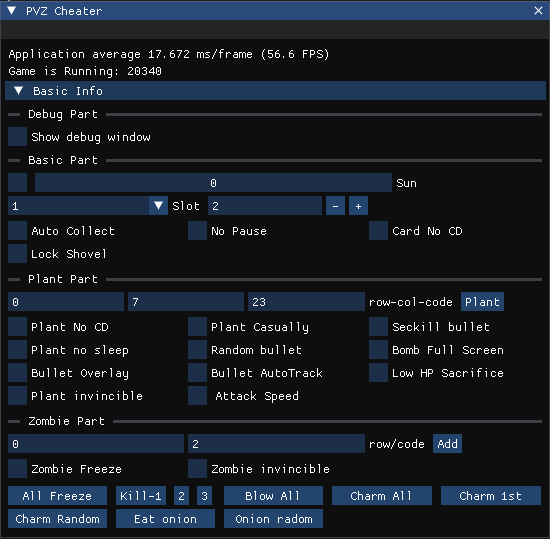
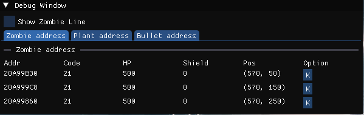
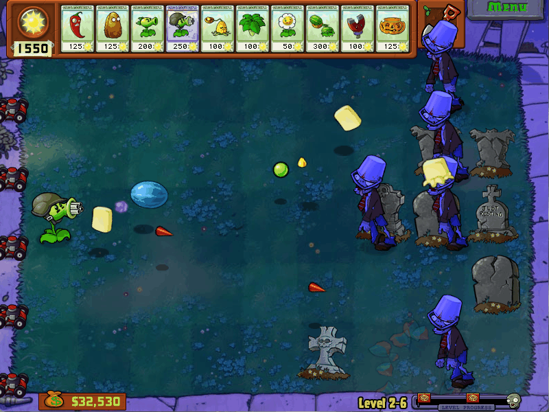

# PVZ Cheater

## Introduction

This is a cheat tool for Plants vs. Zombies.





## Demo



---

# 0x1. Game Basics

```cpp
base = [PlantsVsZombies.exe + 0x329670]

base868 = [base + 0x868]
```

## 1. Base Related

| Name | Offset | Size | Description |
| ---- | ------ | ---- | ----------- |
|      |        |      |             |
|      |        |      |             |
|      |        |      |             |
|      |        |      |             |

---

## 2. Base868 Related

| Name | Offset (base868 + ??) | Description |
| ---- | --------------------- | ----------- |
| ZombieRelative | 0xA8 | Zombie array, array length, maximum zombie count, alive zombie count |
| PlantRelative | 0xC4 | Plant array, array length, maximum plant count, alive plant count |
| BulletRelative | 0xE0 | Bullet array, array length, maximum bullet count, alive bullet count |
| DropObjCount | 0x10C | Number of dropped objects (Sun, Coin) |
| Scene | 0x5564 | `0 = Front Yard Day`, `1 = Front Yard Night`, `2 = Backyard Day`, `3 = Backyard Night` |
| SunCount | 0x5578 | Current sun amount |

---

# 0x2. Sun Related

## Functions

| Name | Function Address | Op Address | Parameters | Return Value |
| ---- | ---------------- | ---------- | ---------- | ------------ |
| AddSunCount | 0x41E6E0 | 0x41E6E0 | `(base868, count)` | - |
| DecSunCount | 0x41E830 | 0x41E846 | `(-, decCount, base868)` | `bool` |

---

## 1. AddSunCount

```cpp
int __usercall addSunCount@<eax>(int result@<eax>, int a2@<ecx>)
{
    int v2;
    char v3[4];
    int v4;

    base868->sunCount += a2;

    // Maximum sun limit: 9990
    if (base868->sunCount > 9990)
        base868->sunCount = 9990;

    if (base868->sunCount >= 8000)
    {
        result = *(result + 0xA4);
        v2 = *(result + 0x94C);

        v3[0] = 1;
        v4 = 12;

        if (v2)
        {
            if (!*(v2 + 48))
                return sub_459670(result, v3);
        }
    }

    return result;
}
```

---

## 2. DecSunCount

```cpp
char __usercall decSunCount@<al>(int a1@<ecx>, int decCount@<ebx>, int base868@<edi>)
{
    int preSunCount;

    preSunCount = base868->sunCount;

    if (decCount > preSunCount + (sub_41E750)(a1, base868))
    {
        (*(**(base868 + 0xA4) + 216))(*(base868 + 0xA4), dword_727310);
        *(base868 + 0x5590) = 70;
        return 0;
    }
    else
    {
        // Decrease sun count
        base868->sunCount = preSunCount - decCount;
        return 1;
    }
}
```

### Purple Card Availability Check

```txt
0040FDE0
```

---

# 0x3. Plant Related

## 1. Plant Info

### Plant Structure

Structure size:

```txt
0x14C
```

| Name (Offset) | Type | Description |
| -------------- | ---- | ----------- |
| base(+0) | void* | Base pointer |
| base868(+4) | void* | Base868 pointer |
| XPos(+8) | int | X position |
| YPos(+C) | int | Y position |
| XWidth(+10) | int | Width |
| YWidth(+14) | int | Height |
| isVisible(+18) | byte | Visibility state |
| row(+1C) | int | Row index |
| plantCode(+24) | int | Plant type |
| col(+28) | int | Column index |
| CurHP(+40) | int | Current HP |
| FullHP(+44) | int | Maximum HP |
| IsAttackType(+48) | int | True if the plant can shoot projectiles |
| BombCD(+50) | int | Explosive plant cooldown |
| ReloadCD(+54) | int | Reload cooldown |
| CurCD(+58) | int | Current cooldown |
| FullCD(+5C) | int | Maximum cooldown |
| Row(+88) | int | Row |
| EmitCD(+90) | int | Attack interval |
| UniqueID(+94) | int | Unique plant ID |
| isDead(+141) | byte | `1 = dead` |
| isDead_2(+142) | byte | `1 = dead` |
| isDisableAttack(+143) | byte | `1 = cannot attack` |
| -(+148) | int | Dead check flag |

---

### Plant Array

```txt
PlantRelative = [base868 + 0xC4]
```

| Name | Offset | Size | Description |
| ---- | ------ | ---- | ----------- |
| ArrPointer | +0 | int* | Array pointer |
| ArrLen | +4 | int | Plant array length |
| MaxAllowPlantCount | +8 | int | Maximum plant count (`1024`) |
| LivedPlantCnt | +10 | int | Current alive plant count |

---

## Important Addresses

| Feature | Address |
| ------- | ------- |
| Add plant count | `00420C37` |
| Free planting check | `004127EF` |
| Ice Shroom | `1045F0C6` |
| Plant skill function | `0046A110` |

Example:

```txt
Doom Shroom: eax = F
```

---

## Plant Timers

| Type | Address |
| ---- | ------- |
| Sun production | `00466E03` |
| Shooter attack | `00466E10` |

---

## 2. Plant Actions

### Cooldown Types

| Name | Offset | Type | Description |
| ---- | ------ | ---- | ----------- |
| ReloadCD | +54 | int | Chomper, Potato Mine, Spikeweed, Cob Cannon, Magnet-shroom |
| CurCD | +58 | int | Sunflower |
| FullCD | +5C | int | Total cooldown |
| EmitCD | +90 | int | Attack countdown |

---

## Plant Attack Process

```cpp
// 0x466B70
int plantAction(Plant p)
{
    if (p->alive)
    {
        checkAndPerformAttack(p);

        p->plantReloadCD > 0 ? p->plantReloadCD-- : 0;

        if (isBallingGameType())
            sub_4666E0();

        // Plant abilities
        // Squash, Doom Shroom, Ice Shroom

        decCD(p);

        if (p->bombCD > 0)
            p->bombCD--;

        if (p->bombCD == 1)
        {
        }
    }
}
```

---

## Attack Handling

```cpp
// 0x468270
int checkAndPerformAttack(Plant p)
{
    if (p->alive)
    {
        if (!p->emitCD)
            return;

        p->emitCD--;

        if (p->code == FumeShroom && p->emitCD == 15)
            bulletPlantAttackOnce(p, 0, p->row, 0);

        else if (p->code == GatlingPea && p->emitCD in [18, 35, 51, 68])
            bulletPlantAttackOnce(p, 0, p->row, 0);

        else if (p->code == Cattail && p->emitCD == 19)
        {
            Zombie z = plantScanGetFirstZombieByRow(0, p, p->row);

            if (z)
                bulletPlantAttackOnce(p, z, p->row, 0);
        }
        else
        {
            if (p->emitCD == 1)
            {
                if (p->code == Threepeater)
                {
                    bulletPlantAttackOnce(p, 0, p->row + 1, 0);
                    bulletPlantAttackOnce(p, 0, p->row, 0);
                    bulletPlantAttackOnce(p, 0, p->row - 1, 0);
                }
                else if (p->code == SplitPea)
                {
                    bulletPlantAttackOnce(p, 0, p->row, 0);
                }
                else
                {
                    if (p->code not in [32, 34, 39, 44])
                    {
                        bulletPlantAttackOnce(p, 0, p->row, 10);
                    }
                    else
                    {
                        Zombie z = plantScanGetFirstZombieByRow(0, p, p->row);

                        if (z)
                            bulletPlantAttackOnce(p, z, p->row, 0);
                    }
                }
            }
        }
    }
}
```

---

# 0x4. Zombie

## Zombie Structure

Structure size:

```txt
0x168
```

| Name (Offset) | Type | Description |
| -------------- | ---- | ----------- |
| base(+0) | void* | Base pointer |
| base868(+4) | void* | Base868 pointer |
| XPos(+8) | int | X position |
| YPos(+C) | int | Y position |
| XWidth(+10) | int | Width |
| YWidth(+14) | int | Height |
| isVisible(+18) | byte | Visibility state |
| row(+1C) | int | Row index |
| code(+24) | int | Zombie type |
| behaviorType(+28) | int | Special behavior flags |
| xPosF(+2C) | float | Float X position |
| yPosF(+30) | float | Float Y position |
| slowDownSpeed(+34) | float | Slowdown effect |
| isCharm(+B8) | byte | Charmed state |
| isBlowToDie(+B9) | byte | Exploded state |
| isIgnorePlant(+BA) | byte | Ignore plants |
| isJumpWater(+BD) | byte | Water jump state |
| isEatOnion(+BF) | byte | Garlic interaction |
| curBlood(+C8) | int | Current HP |
| fullBlood(+CC) | int | Maximum HP |
| curShield(+D0) | int | Current shield HP |
| fullShield(+D4) | int | Maximum shield HP |
| isDead(+EC) | byte | Dead state |

---

## Important Zombie Addresses

| Feature | Address |
| ------- | ------- |
| Add Zombie | `00420B87` |
| Zombie Walk | `0053B443` |
| Zombie Count Update | `41E9E6` |

### Zombie Damage

| Type | Address |
| ---- | ------- |
| HP reduction | `00541CDA`, `00541CE4` |
| Shield reduction | `005419FA` |

### Zombie Position

| Type | Address |
| ---- | ------- |
| Blow position | `0053B68D` |
| Balloon Zombie label | `0046A07D` |

---

## Pause Game Check

```txt
0061607F
```

---

# 0x5. Bullet

| Feature | Address |
| ------- | ------- |
| Change Bullet Position | `471F70` |
| Spawn Bullet | `00470E38` |

---

## Bullet Movement Types

```cpp
// 462440
int __userpurge getPlantAttackType@<eax>(int plantAddr@<eax>, int a2)
{
    int plantCode;

    plantCode = *(_DWORD *)(plantAddr + 0x24);

    switch (plantCode)
    {
        case 26:
            return (a2 != 1) + 1;

        case 2:
        case 20:
        case 47:
        case 15:
            return 0x7F;

        case 39:
        case 32:
        case 34:
        case 44:
            return 0xD;

        case 4:
            return 0x4D;

        case 17:
            return 0xD;

        case 8:
        case 24:
        case 10:
        case 42:
        case 6:
            return 9;

        case 43:
            return 0xB;

        case 19:
            return 5;
    }

    return plantCode != 50 ? 1 : 0x11;
}
```

---

# 0x6. Dropped Objects

| Feature | Address |
| ------- | ------- |
| Decrease dropped object count | `0041EB4F` |
| Increase dropped object count | `00420DF9` |
| Add dropped object function | `0040F400` |
| Natural drop | `4163D0` |
| Plant drop | `463370` |

```txt
[[base868] + 0x10C] = dropped object count
```

---

# 0x7. Functions

## Iterate Zombies

| Feature | Address |
| ------- | ------- |
| Find next zombie | `41F6B0` |

---

